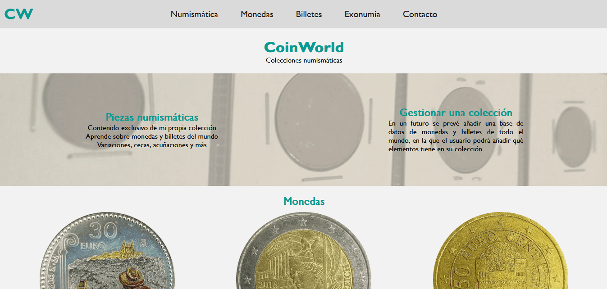
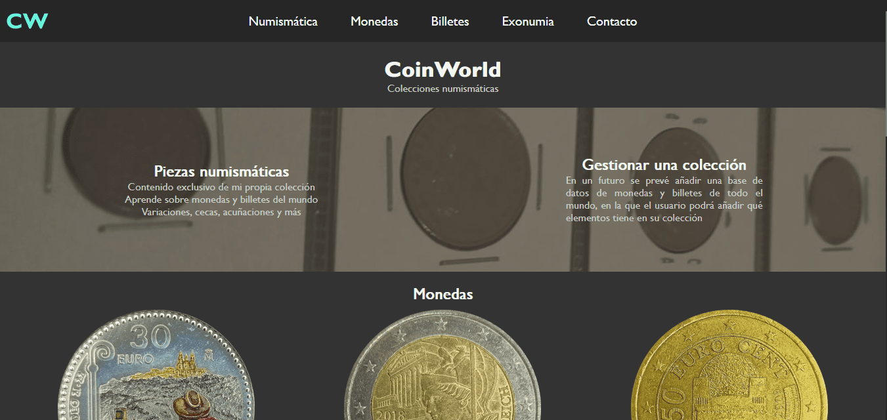
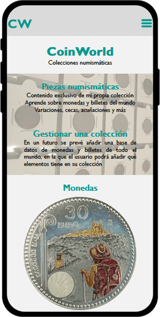
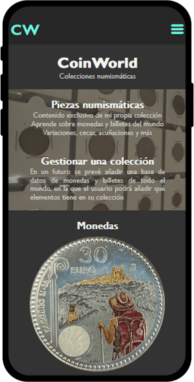
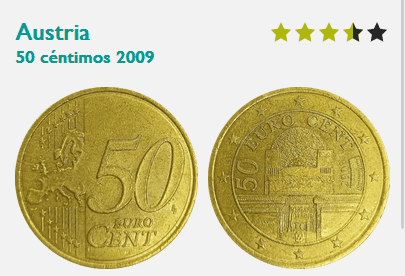
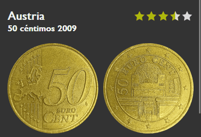

# CoinWorld

## Descripción
CoinWorld es una página web creada por Alex Silva cuya finalidad será organizar y preservar una colección de monedas y billetes de todo el mundo.

En una primera etapa, esta web se mantendrá de forma estática. Todo su contenido será introducido manualmente y siguiendo el curso de las explicaciones. En esencia, a medida que se vayan explicando más cosas esta web se actualizará para cumplir con las expectativas.

Se espera que, una vez finalizada, se pueda iniciar sesión y gestionar una colección individual con monedas y billetes de todo el mundo. No obstante, en los inicios me centraré en introducir las monedas de las que yo dispongo en mi colección y explicar qué es la numismática y los diferentes tipos de piezas que se coleccionan en esta práctica.

## Estructura de los archivos
Los archivos HTML se encuentran en la carpeta raíz, junto a este README y, posteriormente, se hayará también el manifest, utilizado por PWA.

Las carpetas creadas son autodescriptivas, es decir, con leer el nombre de éstas se puede saber qué hay en su interior. No obstante aquí dejo una lista con las diferentes carpetas:

`Si pasas el ratón sobre los enlaces obtendrás más información sobre ellos.`

+ [CSS](css "Archivos de estilo")
+ [Media](media "Contenido multimedia")
  + [Font](media/font "Fuentes de texto")
  + [IMG](media/img "Imágenes") 
    + [Billetes](media/img/billetes/ "Imágenes de billetes")
    + [Exonumia](media/img/exonumia/ "Imágenes de exonumia")
    + [Fondo](media/img/fondo/ "Imágenes utilizadas para fondos")
    + [Monedas](media/img/monedas "Imágenes de monedas")
    + [Otras](media/img/otras/ "Otras imágenes: logotipos de páginas externas")
  + [SVG](media/svg "Imágenes vectoriales")

La estructura del proyecto es la siguiente:
```
proyecto
│   README.md (Este documento)
│   billetes.html (Página dedicada a los billetes)
│   exonumia.html (Página dedicada a la exonumia)
│   index.html (Página de inicio)
│   monedas.html (Página dedicada a las monedas)
│   numismatica.html (Página donde se habla de numismática)
│
└───css
│   │   global.css (Estilos aplicados a todas las páginas)
│   │   index.css (Estilos de la página de inicio)
│   │   monedas.css (Estilos de la página de monedas)
│   │   numismatica.css (Estilos de la página de numismática)
│   
└───js
│   │   tema.js (Script que controla el tema de la web)
│   
└───media
│   │
│   └───font
│   │   │   Gill-Sans-Bold.ttf
│   │   │   Gill-Sans.ttf
│   │
│   └───img (imágenes tomadas por mí)
|   │   └───billetes
│   │   │   |   ES_P147-R.jpg (España P# 147 Reverso)
│   │   │   |   ES_P147.jpg (España P# 147)
│   │   │   |   EUR_10-R.jpg (Billete de 10 euros Reverso)
│   │   │   |   EUR_10.jpg (Billete de 10 euros)
│   │   │   |   US_5-R.jpg (Billete de 5 dólares Reverso)
│   │   │   |   US_5.jpg (Billete de 5 dólares)
|   │   └───exonumia
│   │   │   |   medalla-R.png (Medalla española Reverso)
│   │   │   |   medalla.png (Medalla española)
│   │   │   |   recuerdo-R.png (Moneda elongada de recuerdo Reverso)
│   │   │   |   recuerdo.png (Moneda elongada de recuerdo)
│   │   │   |   replica-R.png (Réplica francesa de una moneda Reverso)
│   │   │   |   replica.png (Réplica francesa de una moneda)
│   │   │   |   token-R.png (Ficha de feria Reverso)
│   │   │   |   token.png (Ficha de feria)
|   │   └───fondo
│   │   │   |   accesorios.jpg
│   │   │   |   album.jpg
│   │   │   |   coins.jpg
│   │   │   |   exonumia.jpg
|   │   └───monedas
│   │   │   |   AT_KM3141.png (Austria KM# 3141)
│   │   │   |   AT_KM3275.png (Austria KM# 3275)
│   │   │   |   ES_UC350-R.png (Reverso de España UC# 350)
│   │   │   |   ES_UC350.png (España UC# 350)
│   │   │   |   EUR_0,50.png (Cara común de 50 céntimos de euro)
│   │   │   |   EUR_2.png (Cara común de moneda de 2 euros)
|   │   └───otras
│   │   │   |   numista.png (Logo de Numista)
│   │   │   |   opennumismat.png (Logo de OpenNumismat)
│   │   │   |   ucoin.png (Logo de Ucoin)
│   │
│   └───svg
│   │   │   CWLetters.svg
│   │   │   CWLettersDark.svg
│   │   │   CWLogo.svg
│   │   │   Darkmode.svg
│   │   │   Lightmode.svg
│   │   │   Menu.svg
│   │   │   MenuDark.svg
```
## Tecnologías utilizadas
### Visual Studio Code
El proyecto se ha desarrollado con VSCode. Gracias a este IDE se ha podido crear un código ordenado y limpio de una forma más sencilla y visual que con un editor de texto.
### Extensión Live Server
Con la extensión Live Server de VSCode, se ha testeado la página web en diversos dispositivos (móviles, portátiles) para poder mejorar la página según los resultados mostrados en cada uno de ellos.  
Además, cada vez que se guardan los documentos editados, se actualizan automáticamente las pestañas de los navegadores.
### GitHub
Se ha trabajado en este proyecto en dos ordenadores, por lo que tener GitHub como repositorio no sólo ha ayudado a generar copias de seguridad, sino que ha permitido pasar archivos entre mis dos ordenadores para poder trabajar desde cualquiera de ellos.  
También permite crear distintas ramas, por ejemplo: en el ordenador de sobremesa he creado una rama donde he implementado un manifest de la web, mientras que en el portátil estos cambios no aparecen porque aún no quiero que se implemente en la rama principal.  
Por último, es una forma de compartir el proyecto con otras personas.
### SVGator
Mediante esta herramienta en línea gratuita, he diseñado algunos de los SVGs utilizados en este proyecto de manera fácil y rápida.
### Adobe Illustrator
Algunas de las funcionalidades de SVGator están limitadas, por lo que he aprovechado también este software para terminar de pulir los archivos vectoriales. Además de permitirme editar algunas imágenes que en Photoshop no se podían abrir (billetes estadounidenses).
### Adobe Photoshop
He tomado diversas imágenes con mi smartphone para colgar en la página web. Las de monedas han sido recortadas y rotadas con esta herramienta o con el editor de imágenes de Android.
### ILoveImg
Las fotografías que he tomado ocupaban 10MB porque tenían una resolución de 8000x6000px. Las he reducido a 300px de ancho y las he comprimido gracias a esta herramienta online, reduciendo su tamaño a unas decenas de kilobytes.

## Características y funcionalidades
### 18 de noviembre de 2023
+ Compatibilidad con modo claro y oscuro
+ Fuentes personalizadas
  + [Gill Sans](https://freefontsdownload.net/free-gill-sans-mt-font-37146.htm)
+ Barra de navegación con desplegable
  + Hecho con checkbox y label para hacerlo funcional con CSS, sin utilizar JavaScript
  + [Fuente de la idea](https://stackoverflow.com/questions/13630229/can-i-have-an-onclick-effect-in-css)
+ Logotipos e iconos del desplegable SVG
  + Diseñados en [SVGator](https://app.svgator.com/)
  + Modificados en Adobe Illustrator
### 19 de noviembre de 2023
+ Diseño Mobile first
  + Los CSS están diseñados de manera que lo predeterminado es visualizar el contenido en una pantalla pequeña, como un móvil. Luego hay media queries que cambian algunos elementos si la pantalla es lo suficientemente grande.
+ Segregación de CSS
  + Para reducir la longitud de los CSS y evitar duplicados
+ Favicon
  + Icono SVG que aparece en la barra de navegación
+ Página de inicio
  + Creación de la primera página que se verá al entrar en la web. En esta aparecen dos notas acerca de qué irá la página, además de enseñar algunos elementos de la colección.
### 20 de noviembre de 2023
+ Toma de imágenes
  + He añadido las imágenes que faltaban en la página de inicio. Las fotografías son de elementos de mi propia colección, tomadas con la cámara del móvil a máxima resolución, luego comprimidas y redimensionadas con ILoveIMG.
### 22 de noviembre de 2023
+ Página de numismática
  + Se ha creado una página donde se habla de qué es la numismática, con diversas imágenes y artículos.
### 30 de noviembre de 2023
+ Página de monedas
  + Se ha finalizado la creación de la página dedicada a monedas. Artículos de 3 monedas de diferentes tipos.
### 1 de diciembre de 2023
+ Página de billetes
  + Artíuculos de tres billetes diferentes
+ Página de exonumia
  + Artíuculos de cuatro piezas de exonumia diferentes
### 3 de diciembre de 2023
+ Añadidas las imágenes que quedaban
+ Revisar y comentar los archivos
### 6 de diciembre de 2023
+ Cambios menores
+ Finalizado el proyecto de la práctica 2

## Interactividad JavaScript
### 15 de febrero de 2024
+ Implementación de JavaScript en el proyecto
+ Cambios en la compatibilidad de modo claro y oscuro
  + Antes sólo se podía cambiar si el navegador estaba en un modo u otro. Ahora al cargar la página por primera vez se guarda en localStorage el modo preferido por el usuario y, además, se pondrá un botón en el pie de página para poder cambiar este modo. Al pulsarlo se guardará el nuevo valor en la variable local y cuando se recargue la página se mantendrá el modo de la última sesión.
  + Para que esta función sea aplicable en todas las páginas hay que abrir la web desde un dominio, con la extensión de Live Server se puede lograr el mismo efecto. Si no se hace, el cambio de tema sólo tendrá efecto en la página en la que se haya pulsado el botón.
### 21 de febrero de 2024
+ Agregado formulario de contacto
  + Se ha introducido en la barra de navegación un nuevo botón que conduce a un formulario desde el cuál un usuario puede introducir su nombre, correo electrónico y un mensaje que mandar.
### 29 de febrero de 2024
+ Actualizado formulario de contacto
  + El formulario introducido mediante HTML ahora cuenta con validación JavaScript.
  + Estilos CSS
  + Mensajes de validación que informan al usuario de qué errores pueden tener los campos.
  + Notificación emergente
    + Al enviar el formulario de contacto se pide confirmación por parte del usuario a través de una notificación emergente.
  + Carga dinámica de contenido
    + Hay elementos del formulario que se muestran o ocultan mediante JavaScript
+ Sistema de valoración
  + Cada elemento numismático de la web tiene una valoración que va del 0 al 10. Esta valoración inicialmente está en 0 y el usuario puede valorar como guste. Este valor puede ser cambiado en cualquier momento y además se mantiene cuando se actualiza la página o se cierra el navegador
  + Los iconos de las estrellas han sido creados por mí en SVGator
  + Hay iconos de estrellas vacías y medio vacías para modo claro y para modo oscuro

## Galería
<table align="center">
  <tr>
    <th>Modo claro
    <th>Modo oscuro
  <tr>
    <th colspan=2>Web responsiva
  <tr>
    <td>
    <td>
  <tr>
    <td>
    <td>
  <tr>
    <th colspan=2>Valoraciones
  <tr>
    <td>
    <td>
